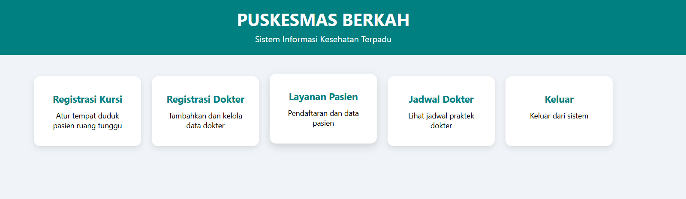
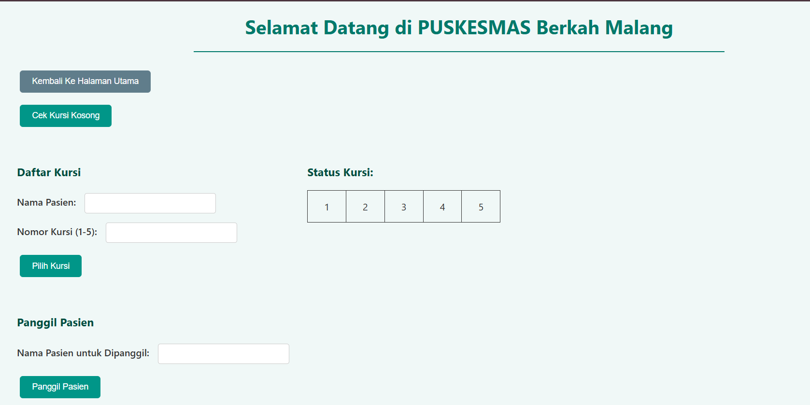

# ➕ **Puskesma - School Task**


> **Deskripsi Singkat:**  
> Web **Puskesmas** sederhana buat mendeklarasikan **pasien kursi duduk** dan **pasien keluar ruangan**.
> Desain yang **minimalis dan kontras** membuat user bisa nyaman dalam penginputannya

---

## 📑 **Table of Contents**
- [✨ Fitur](#-fitur)
- [📸 Preview](#-preview)
- [🛠️ Teknologi](#️-teknologi)
- [🚀 Instalasi & Penggunaan](#-instalasi--penggunaan)
- [📂 Struktur Folder](#-struktur-folder)
- [💡 Rencana Pengembangan](#-rencana-pengembangan)
- [🤝 Kontribusi](#-kontribusi)
- [📜 Lisensi](#-lisensi)

---

## ✨ **Fitur**
- 📝 **Memilih Kuris Tunggu**
- 📅 **Memanggil Pasien**
- 📱 **Indikator Keluar Pasien**

---

## 📸 **Preview**
  
  


---

## 🛠️ **Teknologi**
- **HTML5** → Struktur halaman
- **CSS3** → Styling dan layout
- **JavaScript** → Logika aplikasi

---

## 🚀 **Instalasi & Penggunaan**
1. **Clone Repository**
   ```bash
   git clone https://github.com/Yohnzz/Puskesmas.git
